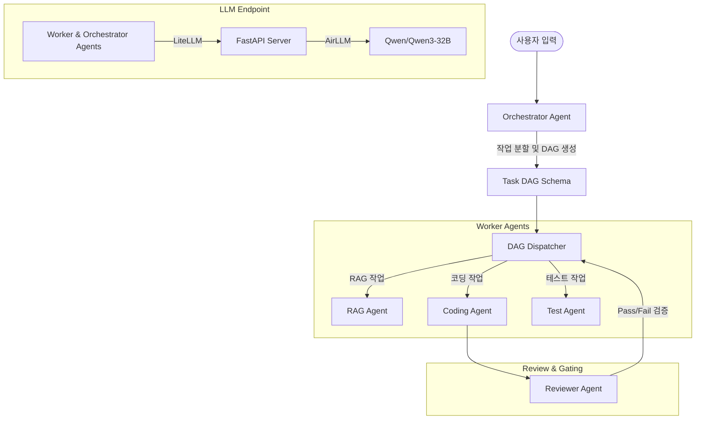

# CLID (Coding-LLM Inference Dispatcher) 🚀

Google ADK(Agent Development Kit)와 로컬 LLM을 기반으로 작동하는 **멀티 에이전트 코딩 시스템 프로토타입**입니다. 사용자의 개발 요청을 분석하여 작업 의존성 그래프(DAG)를 구성하고, 각 작업에 적합한 전문 에이전트(RAG, Coding, Test, Reviewer)가 협업하여 태스크를 수행합니다.

---

## 📌 주요 특징

* **로컬 LLM 지원**: `AirLLM`을 활용하여 대형 모델(`Qwen/Qwen3-32B`)을 로컬에서 구동 및 서빙합니다.
* **DAG 기반 태스크 관리**: 오케스트레이터 에이전트가 요청을 여러 작업으로 분할(Decomposition)하고 의존 관계에 따라 병렬 처리합니다.
* **에이전트 협업 워크플로우**: RAG, Coding, Test 에이전트의 작업 결과를 Reviewer 에이전트가 검증(Pass/Fail)하는 게이팅 시스템을 갖추고 있습니다.
* **Google ADK 기반**: 에이전트 간의 정교한 상호작용과 도구 사용이 Google ADK 프레임워크 상에서 정의됩니다.

---

## 🏗️ 시스템 아키텍처



---

## 📁 프로젝트 구조

```text
clid-test/
├── agents/
│   ├── __init__.py
│   ├── orchestrator.py    # 전체 요청을 분석하여 TaskGraph DAG 생성
│   └── workers.py         # RAG, Coding, Reviewer 에이전트 정의
├── tools/
│   ├── __init__.py
│   ├── coding_tools.py    # 코딩 및 테스트 실행 관련 도구 (Mock)
│   └── rag_tools.py       # RAG 정보 검색 도구 (Mock)
├── app_server.py          # AirLLM 기반 로컬 FastAPI 모델 서버 (127.0.0.1:8000)
├── dispatcher.py          # 작업 의존성을 파악하고 병렬 실행하는 DAG 디스패처 (Mock)
├── dispatcher_TP.py       # 실모델 호출용 디스패처 (개발 진행 중)
├── main.py                # 인터랙티브 실행 진입점
├── main_TP.py             # 오케스트레이터의 생각 과정(Think Block) 기록용 진입점
├── schema.py              # Pydantic 데이터 스키마 (TaskGraph, ReviewResult 등)
├── requirements.txt       # 의존성 패키지 목록
└── CLAUDE.md              # 개발 가이드 문서
```

---

## 🛠️ 설치 및 실행 방법

### 1. 가상환경 설정 및 패키지 설치
Python 3.11 가상환경을 권장합니다.

```bash
# 가상환경 활성화 (Windows 예시)
..\myenv-311\Scripts\activate

# 패키지 설치
pip install -r requirements.txt
# airllm이 설치되지 않은 경우 추가 설치
pip install airllm
```

### 2. 로컬 모델 서버 및 메인 프로그램 실행
`main.py`는 내부적으로 `app_server.py`를 데몬 스레드로 실행하고 서버가 완전히 켜질 때까지 대기합니다.

```bash
python main.py
```

> [!NOTE]
> 첫 실행 시 `Qwen/Qwen3-32B` 모델을 HuggingFace에서 다운로드하므로 네트워크 상태에 따라 로드에 수 분 이상 소요될 수 있습니다.

* **상세 생각 로그(Thinking Process) 확인**: 오케스트레이션 과정을 더 상세히 모니터링하려면 `main_TP.py`를 실행하세요. 생성된 로그는 `orchestrator_TP_logs.json`에 기록됩니다.
  ```bash
  python main_TP.py
  ```

---

## ⚠️ 현재 상태 및 주의사항 (Mock & Prototype)

* **도구 및 디스패처 Mocking**: 현재 기본 `dispatcher.py`와 `tools/` 내부 도구들은 시뮬레이션을 위해 Mock(가짜) 데이터와 지연 시간을 리턴하도록 작성되어 있습니다.
* **실제 LLM 작동 테스트**: 실제 로컬 LLM을 연동하여 테스트하려면 `dispatcher_TP.py`를 참고하여 개발을 이어서 진행해야 합니다. (`dispatcher_TP.py` 내의 `upstream_outputs` 정의 오류 수정이 필요합니다.)
