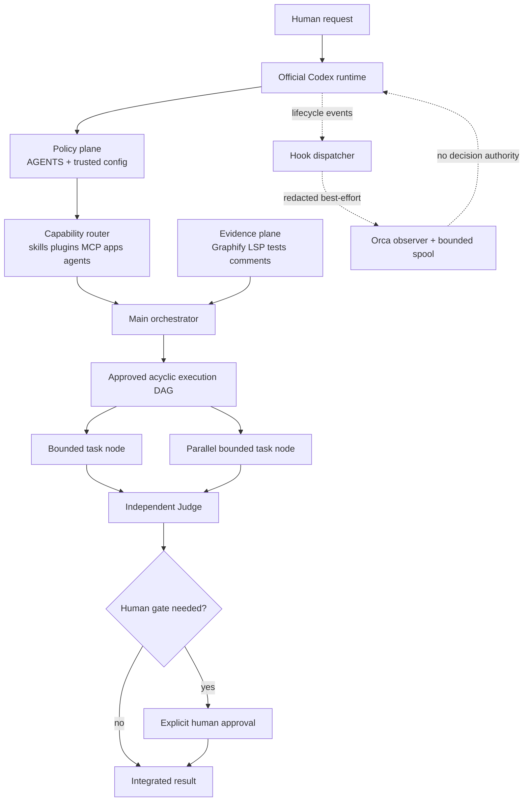

# Codex 하네스 교집합 구조 제안

## 결론

현재 기기의 구조를 기반으로 유지하고, 다른 기기의 OMO 하네스에서 검증된 운영 패턴만 선택적으로 흡수하는 것이 가장 안전하다. 새 구조의 중심은 **공식 Codex 런타임 + ECC 정책 + 승인된 실행 DAG**이며, OMO는 중앙 실행기가 아니라 규칙·LSP·댓글·연속성 같은 **선택적 검증 어댑터 묶음**으로 제한한다. Orca는 결정 권한이 없는 **비차단 관측 브리지**로 격리한다.

제안 명칭은 **Codex Graph Control Plane(C-GCP)**이다.

핵심 원칙은 다음 한 문장으로 요약된다.

> Codex가 실행하고, ECC가 정책을 정하며, DAG가 순서를 통제하고, 증거 도구가 사실을 만들고, Judge가 검증하며, Human이 최종 권한을 갖고, Orca는 관측만 한다.

## 증거와 신뢰도

| 라벨 | 의미 | 사용 범위 |
| --- | --- | --- |
| `current-verified` | 이 기기에서 파일·명령·실제 DAG 실행으로 확인 | 현재 구성과 동작 |
| `official-manual` | 현재 캐시된 공식 Codex 매뉴얼에서 확인 | 공식 지원 표면과 권장 경계 |
| `user-supplied snapshot` | 사용자가 제공한 다른 macOS 기기의 조사 결과 | 비교와 패턴 후보만 |
| `unknown` | 금지된 설정·비밀값·실제 네트워크 호출 없이는 확정 불가 | 활성화, 인증, 라이브 전달 상태 |

주요 근거:

- `current-verified`: Codex CLI `0.150.1`이 호출 가능하다.
- `current-verified`: 플러그인 manifest 13개가 존재하지만 실제 활성화 상태는 별도 증거가 없어 `unknown`이다.
- `current-verified`: 프로젝트 Daily skill 28개, 시스템 skill 6개, library catalog 89개가 존재한다.
- `current-verified`: TOML 역할 7개와 Markdown agent 정의 67개가 존재한다. 이번 조사에서는 협업 API로 탐색자와 Judge를 실제 실행했으므로 현재 세션의 서브에이전트 기능은 호출 가능하지만, 구성 파일의 API 버전/feature flag는 `unknown`이다.
- `current-verified`: MCP 레지스트리에 35개 항목이 있고, 이 세션의 실제 도구 표면에는 257개 호출 가능 도구가 노출됐다. 레지스트리 존재는 연결·인증 성공을 뜻하지 않는다.
- `current-verified`: `C:/vsc/.codex/hooks.json`에는 `PreToolUse`/`Bash` Graphify `hook-check`가 구성되어 있으나 이번 조사에서 실제 호출 여부는 증명하지 않았다.
- `current-verified`: OMO 4.19.4의 Rules/LSP/Codegraph/Comment Checker/Continuation/Executor Verify payload와 hook manifest가 Orca runtime home에 존재하지만 active registry 등록 여부는 `unknown`이다.
- `official-manual`: Codex는 AGENTS 계층, hooks, plugins/skills, MCP, 서브에이전트를 공식 표면으로 제공한다. 근거는 `C:/Users/picom/AppData/Local/Temp/openai-docs-cache/codex-manual.md:1985`, `:22494`, `:23118`, `:25311`, `:26761`이다.
- `user-supplied snapshot`: 다른 기기에서는 OMO 4.19.4가 중앙 네임스페이스이며 광범위한 훅, 12개 역할, multi_agent_v1 fallback, Orca pane spool이 보고됐다. 해당 기기는 이 작업에서 직접 검증하지 않았다.

## 현재 구조와 다른 기기 비교

| 영역 | 현재 기기 (`current-verified`) | 다른 기기 (`user-supplied snapshot`) | 교집합 결정 |
| --- | --- | --- | --- |
| 실행 커널 | 공식 Codex CLI/App 도구 표면 | Codex 위에 OMO가 중앙 네임스페이스 역할 | 공식 Codex를 유일한 실행 커널로 유지 |
| 정책 | 루트·프로젝트 AGENTS와 ECC 지침 | OMO Rules 및 프로젝트별 지침 | AGENTS를 정책의 단일 기준으로 사용하고 OMO Rules는 어댑터화 |
| 작업 구조 | budgeted capsule, 외부 DAG, 독립 Judge | Ultrawork/loop, start-work, teammode | 외부 DAG를 유일한 스케줄러로 하고 반복은 노드 내부로 제한 |
| Agent | 실제 병렬 탐색/Judge 사용 가능; 파일상 역할 다수 | 12개 고정 역할과 v1 fallback | 역할을 `explorer/worker/judge` 중심으로 축소하고 난이도별 모델만 라우팅 |
| Skill/plugin | 다수의 Daily/system/library skill과 plugin manifest | OMO 중심의 넓은 plugin/skill 묶음 | 능력 registry에서 `present/configured/callable/healthy` 상태를 분리 |
| MCP/apps | registry 35개, 현재 도구 257개 | OMO MCP 5개와 혼합 활성 상태 | MCP를 능력 브로커 뒤에 두고 중복 namespace와 인증 상태를 명시 |
| Hook | 프로젝트 Graphify PreToolUse 구성; OMO payload 활성 여부 불명 | 넓은 lifecycle hook 적용이 보고됨 | 하나의 dispatcher와 dedup 규칙으로 중복 실행 차단 |
| 증거 | Graphify, LSP, 테스트, capsule result, DAG audit | Codegraph, LSP, comment, executor receipt | 각 증거의 provenance/freshness를 보존하고 서로 대체하지 않음 |
| 상태/복구 | DAG의 immutable graph, hash-chain events, checkpoint | continuation, Stop/SubagentStop, pane spool | 실행 상태와 관측 spool을 분리하고 checkpoint만 실행 복구에 사용 |
| Orca | 로컬 transport 코드·artifact 존재; live 전달 불명 | 로컬 endpoint + pane spool 보고 | fail-open observer로만 사용, 정책·Judge 권한 금지 |
| Telemetry | 활성 상태 불명 | 익명 통계 보고 | 명시적 opt-in, 최소 필드, TTL, redaction을 요구 |

## 유지할 것과 버릴 것

### 현재 기기에서 유지

- 공식 Codex의 AGENTS, hooks, plugin, skill, MCP, subagent 표면
- ECC의 S/M/L/XL 분류, 단계 승인, 소유권, 예산, hard stop
- Graphify의 소스/영향 증거 역할
- 외부 비순환 DAG와 노드 내부 유한 반복
- immutable acceptance digest, hash-chain event log, recoverable checkpoint
- 독립 Judge와 Human 최종 권한
- Windows 경로 정규화를 포함한 소유권 충돌 검증

### 다른 기기에서 흡수

- SessionStart부터 SubagentStop까지의 넓은 lifecycle 관측 지점
- 탐색·계획·구현·QA·최종 게이트를 구별하는 역할 사고방식
- Stop/PostCompact 이후의 명시적 연속성 처리
- endpoint 실패 시 제한된 로컬 spool을 사용하는 Orca degraded mode
- executor receipt처럼 워커 결과에 기계 검증 가능한 증거를 요구하는 방식
- 호환성 실패 시 v2를 무조건 고집하지 않고 검증된 API로 fallback하는 운영 태도

### 흡수하지 않을 것

- OMO를 모든 기능의 중앙 실행기 또는 단일 네임스페이스로 만드는 구조
- file presence를 활성화나 정상 동작으로 간주하는 방식
- Codegraph/Graphify를 실행 상태 저장소나 스케줄러로 사용하는 방식
- worker가 자기 결과를 승인하거나 acceptance를 수정하는 구조
- 모든 작업에서 12개 역할을 항상 가동하는 고정 팀
- multi_agent_v1/v2를 설정에 영구 고정하는 방식
- Orca 전달 성공이나 telemetry를 제품·코드 검증 증거로 사용하는 방식
- 동일 이벤트에 여러 훅이 독립적으로 차단 결정을 내리면서 순서·중복을 정의하지 않는 방식

## 제안 계층



### 0. 공식 Codex 런타임

- CLI/App/IDE, sandbox, approval, tool invocation, plugin/skill/MCP/subagent를 제공한다.
- 다른 계층은 Codex를 감싸는 정책이나 어댑터이지, 별도 실행 커널이 아니다.

### 1. Policy plane

- 전역 `AGENTS.md`에는 개인 공통 원칙만 둔다.
- 프로젝트 루트 `AGENTS.md`에는 빌드·테스트·보안·오케스트레이션 계약을 둔다.
- 하위 `AGENTS.override.md`는 좁은 subtree 예외만 소유한다.
- 동일 규칙을 OMO Rules와 AGENTS에 복제하지 않는다. OMO는 최종 병합된 정책을 읽기만 한다.

### 2. Capability router

각 능력은 다음 상태를 별도로 기록한다.

```text
present -> configured -> enabled -> callable -> healthy -> authorized
```

- `present`만으로 실행하지 않는다.
- MCP 인증 여부와 도구 호출 가능 여부를 구분한다.
- 같은 기능이 app connector와 MCP 양쪽에 있으면 한 작업에서 선호 경로 하나만 선택한다.
- agent 역할은 목적과 소유권으로 선택하고 이름 개수로 선택하지 않는다.

### 3. Evidence plane

| 증거 | 책임 | 금지 사항 |
| --- | --- | --- |
| Graphify | 프로젝트 소스 관계와 영향 범위 | 실행 이벤트·승인 상태 저장 |
| LSP | 진단, 정의, 참조, rename 안전성 | 테스트 성공 대체 |
| 테스트/검증기 | 결정적 행위와 회귀 증명 | Human 제품 승인 대체 |
| Comment checker | 설명성·주석 품질 신호 | 보안·정확성 최종 판정 |
| Worker receipt | 실행 명령·exit code·artifact 기록 | 자기 승인 |
| DAG audit | 상태 전이·acceptance digest·retry 기록 | 소스 그래프 역할 |

모든 증거에는 `source`, `timestamp`, `scope`, `digest`, `freshness`, `confidence`를 붙인다.

### 4. Orchestration control plane

- trivial 작업은 단일 capsule로 처리한다.
- 실제 dependency, parallel branch, join, human gate가 있을 때만 DAG를 사용한다.
- main orchestrator만 분류·단계 승인·통합을 소유한다.
- worker는 bounded capsule, 명시적 파일 소유권, tool/retry budget만 받는다.
- parallel writer는 가능하면 별도 worktree를 사용한다.
- outer graph에는 back-edge가 없다.

### 5. Node-local loop

```text
PENDING -> RUNNING -> VERIFYING -> SUCCEEDED
                         |
                         v
                     RETRYING -> RUNNING
                         |
                    retry exhausted
                         v
                     ESCALATED
```

- retry는 immutable `maxRetries`를 넘을 수 없다.
- acceptance는 init 이후 변경할 수 없다.
- worker는 `RUNNING/VERIFYING`까지만 올릴 수 있다.
- Judge만 `VERIFYING -> SUCCEEDED/RETRYING`을 결정한다.

### 6. Verification and authority plane

| 역할 | 할 수 있음 | 할 수 없음 |
| --- | --- | --- |
| Main orchestrator | 분류, 승인 요청, 통합, 충돌 해결 | 자기 결과의 독립 판정 |
| Explorer | 읽기 전용 증거 수집 | 구현, 승인 기준 수정 |
| Worker | 소유 파일 구현, 테스트, receipt 작성 | 범위 초과, merge/push, 자기 승인 |
| Judge | diff·증거·acceptance 판정 | 구현 수정, Human 권한 행사 |
| Human | 단계 선택, gate, 최종 수용, 외부 행동 승인 | 자동 위임으로 권한이 묵시적으로 확대되지 않음 |
| Orca observer | 상태 표시, redacted event 전달·spool | 차단, 재시도, 성공 판정, acceptance 수정 |

### 7. Hook dispatcher

Codex 공식 동작상 여러 matching command hook은 병렬로 시작될 수 있으므로, 중복 차단 로직을 여러 독립 hook에 배포하지 않는다. 한 config layer에서는 `hooks.json`과 inline `[hooks]` 중 하나만 사용한다.

dispatcher는 이벤트를 다음 세 lane으로 분리한다.

1. `policy`: 비밀 노출, destructive command, 권한 위반. 실패 시 fail-closed.
2. `evidence`: LSP, comment, Graphify guidance, receipt. 도구 실행을 무조건 막기보다 node를 VERIFYING에서 멈추고 증거 부족을 표시한다.
3. `observe`: Orca와 telemetry. 항상 fail-open이고 bounded spool만 허용한다.

중복/재귀 방지 키:

```text
eventId + handlerId + inputDigest + origin + hookDepth
```

- 동일 키는 한 번만 처리한다.
- `origin=orca` 또는 `hookDepth>1`인 관측 이벤트는 재전송하지 않는다.
- hook 결과는 서로의 실행 순서를 가정하지 않고 dispatcher가 최종 정책 결정을 합성한다.

## 이벤트와 상태의 단일 기준

| 관심사 | 단일 기준 | 복제 가능한 파생물 |
| --- | --- | --- |
| 정책 | AGENTS + trusted Codex config | OMO rule cache |
| 능력 상태 | capability registry/probe 결과 | UI 목록, 보고서 |
| 작업 정의 | capsule + immutable run `graph.json` | Mermaid view |
| 실행 상태 | hash-chained `events.jsonl` | recoverable `checkpoint.json` |
| 소스 관계 | 프로젝트별 `graphify-out/graph.json` | wiki/report/HTML |
| 검증 판정 | Judge result + DAG transition | 최종 요약 |
| 외부 권한 | Human의 명시적 승인 이벤트 | 감사 로그 |
| 관측 | Orca event stream/spool | UI 상태, 통계 |

Orca spool은 실행 복구에 사용하지 않는다. checkpoint가 손상되면 hash-chain event log로 재구성하고, event log 무결성까지 실패하면 `ESCALATED`한다.

## 실패 정책

| 실패 | 정책 |
| --- | --- |
| 비밀·권한·파괴 명령 검사 실패 | fail-closed, Human에게 반환 |
| DAG definition/event hash 불일치 | fail-closed, node/run `ESCALATED` |
| 필수 테스트·Judge 증거 부족 | 성공 금지, `VERIFYING` 유지 또는 bounded retry |
| LSP daemon 불가 | 증거 불완전 표시; LSP가 acceptance이면 성공 금지 |
| Graphify 없음 | 직접 소스 탐색; 글로벌 하네스에 임의 생성 금지 |
| MCP/app 인증 실패 | 해당 capability 비활성화 후 안전한 대체 경로 또는 hard stop |
| Agent API 오류 | 독립 작업만 제한적으로 단일-agent fallback; acceptance 유지 |
| Orca endpoint 불가 | 실행 계속, redacted bounded spool; TTL 이후 폐기 |
| Telemetry 실패 | 무시하고 실행 계속 |
| checkpoint 손상 | event log replay; replay 실패 시 `ESCALATED` |
| 중복 hook 감지 | 두 번째 실행 drop, audit warning 기록 |

## 모델 라우팅

- Main orchestrator와 독립 Judge: `gpt-5.6-sol`
- 읽기 전용 탐색·인덱싱·반복 체크: `gpt-5.6-luna`
- 일상 구현·테스트·bounded refactor: `gpt-5.6-terra`
- 보안·마이그레이션·모호한 cross-module 판단: `gpt-5.6-sol`

모델 선택은 agent 이름이 아니라 task capsule의 난이도·위험·acceptance에 의해 결정한다. 사용자 지정 모델은 해당 capsule에서 우선한다.

## 도입 단계

이 제안은 구현이나 활성화를 수행하지 않는다. 도입 시 단계별로 별도 승인을 받는다.

### Stage 0 — 상태 manifest

- 산출물: plugin/skill/MCP/agent/hook의 상태를 `present/configured/enabled/callable/healthy/authorized`로 분리한 읽기 전용 manifest.
- 검증: 실제 probe와 manifest가 일치하고 비밀값이 포함되지 않는다.
- 롤백: manifest 삭제만으로 원상복구; 실행 경로 변화 없음.

### Stage 1 — 정책 단일화

- 산출물: AGENTS를 단일 정책 기준으로 정하고 중복 OMO rule을 참조형 어댑터로 전환하는 계획.
- 검증: 동일 요청에 적용되는 정책의 출처·precedence가 하나로 재구성된다.
- 롤백: 기존 rule cache/manifest로 복귀; AGENTS 변경은 diff로 되돌릴 수 있어야 한다.

### Stage 2 — Hook dispatcher dry-run

- 산출물: fixture 이벤트만 처리하는 dispatcher와 dedup/recursion/failure-mode 테스트.
- 검증: 실제 hook 이벤트나 Orca endpoint를 호출하지 않는 contract test, 각 event당 handler 1회, observe lane 실패가 실행을 막지 않음.
- 롤백: dispatcher를 등록하지 않고 fixture만 제거.

### Stage 3 — DAG pilot

- 산출물: M 등급의 한 프로젝트에서 capsule/DAG/receipt/Judge를 로컬 전용으로 실행.
- 검증: cycle·ownership collision·retry cap·Judge role·human gate·event tamper 테스트, Graphify와 runtime event 분리.
- 롤백: 새 run 생성을 중지하고 기존 단일-agent workflow 사용; audit artifact는 보존.

### Stage 4 — 선택적 OMO validator adapter

- 산출물: 필요한 프로젝트에만 Rules/LSP/Comment/Continuation/Executor Verify를 하나씩 연결.
- 검증: 각 validator의 활성 상태, timeout, fail mode, evidence schema를 독립 테스트하고 중복 hook이 0개임을 확인.
- 롤백: adapter 단위 비활성화; Codex core와 DAG는 영향받지 않음.

### Stage 5 — Orca observer

- 산출물: redaction, TTL, size cap, dedup을 갖춘 best-effort local event bridge.
- 검증: endpoint 단절·재시작·중복·spool full fixture에서 실행 결과가 변하지 않음.
- 롤백: observer 비활성화와 spool 폐기; 실행 상태는 DAG event log에서 유지.

### Stage 6 — Agent API 호환성 평가

- 산출물: v1/v2를 이름으로 고정하지 않고 현재 callable capability를 probe하는 adapter.
- 검증: HTTP 오류·부분 결과·agent stop·fallback에서 ownership과 acceptance가 유지됨.
- 롤백: 검증된 단일-agent 또는 현재 collaboration API로 복귀.

## 구현 전 결정할 항목

1. 실제 활성 plugin 목록은 manifest가 아니라 어떤 trusted source로 확정할 것인가?
2. 현재 OMO hook manifest 중 실제 active registry에 등록된 것은 무엇인가?
3. project `PreToolUse` Graphify hook과 향후 dispatcher의 소유권을 어디에 둘 것인가?
4. MCP registry 35개 중 현재 프로젝트에 허용할 최소 집합은 무엇인가?
5. LSP server configuration이 없는 현재 상태에서 어떤 언어부터 활성화할 것인가?
6. Orca의 Codex 전용 endpoint/spool 형식과 retention/redaction 계약은 무엇인가?
7. 다른 기기의 multi_agent_v2 HTTP 400을 재현할 수 있는 비밀 제거 로그가 있는가?
8. telemetry는 기본 off로 둘지, opt-in 시 어떤 최소 필드와 TTL을 사용할 것인가?

## 최종 권고

**병합하되 대치하지 않는다.** 현재 기기의 공식 Codex + ECC + budgeted DAG를 기반으로 두고, OMO의 좋은 기능은 capability registry 뒤의 검증 어댑터로 하나씩 편입한다. 다른 기기의 OMO 중심 구조를 통째로 가져오면 hook 중복, 상태 기준 다중화, 활성화 오판, 플랫폼 경로 의존성이 함께 들어온다.

우선순위는 `상태 manifest -> 정책 단일화 -> hook dry-run -> DAG pilot -> OMO validator -> Orca observer`이다. 각 단계는 별도 Human 승인과 독립 Judge를 통과해야 다음 단계로 넘어간다.
