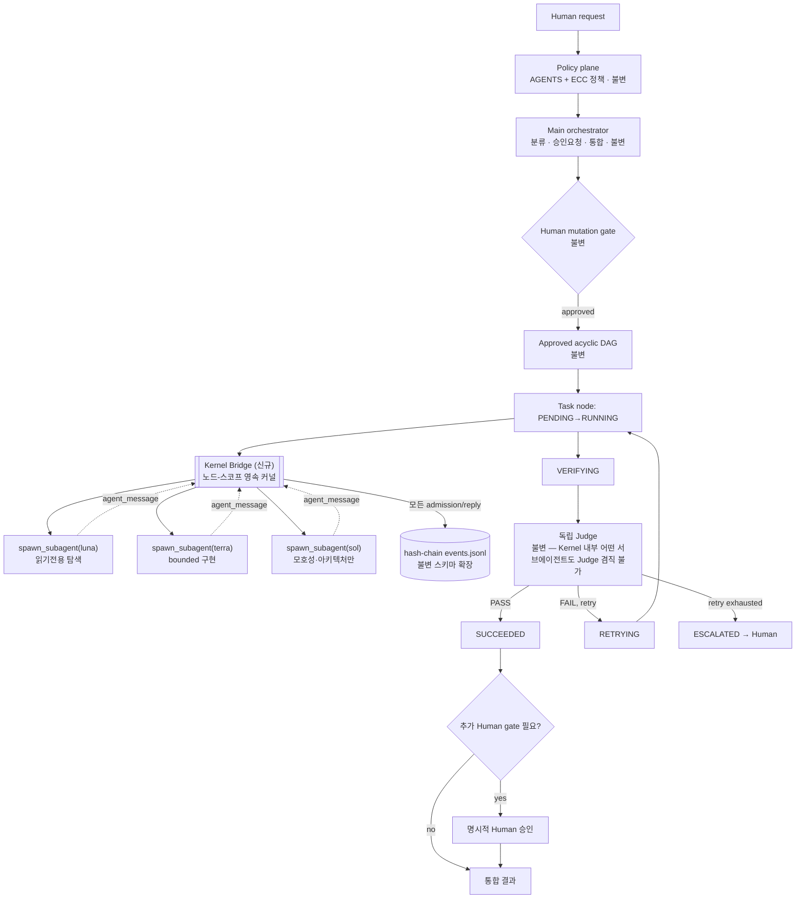

# Kernel-Bridge 하네스 제안 (K-GCP: Kernel-Augmented Graph Control Plane)

## Stage 0 결과 (2026-09-01, current-verified)

**상태: PASS.** `.orchestrator/kernel-bridge/kernel_bridge.py`(exec/list/teardown, spawn 미구현)를 실제로 구현하고 격리된 venv(`.orchestrator/kernel-bridge/.venv`, Python 3.12)에서 검증했다.

- **상태 지속성**: `exec "x=41"` → `exec "x=x+1"` → `exec "print(x)"`를 **세 번의 별도 프로세스 호출**로 실행, `42` 정확히 유지됨 확인.
- **노드 스코프 종료**: `teardown`이 실제 `shutdown_request` 프로토콜 메시지로 커널을 정상 종료시키고(강제킬 불필요), `connection.json`/`kernel.pid` 정리, 프로세스가 OS에서 실제로 사라짐을 `tasklist`로 확인.
- **발견하고 고친 버그(공유 가치 있음)**: Windows에서 `independent=True`로 띄운 ipykernel은 `ipykernel_launcher`(경량 트램폴린) → `python -m ipykernel`(실제 무거운 프로세스) 두 단계로 실행되고, `KernelManager.provisioner.process.pid`는 트램폴린 PID만 가리켜서 진짜 커널 PID가 아니었다. 또한 `KernelManager`는 자신이 쓴 connection file을 매니저 객체가 GC될 때 자동 삭제해서(`independent=True`와 무관하게), 프로세스 재호출 간 재접속이 원천적으로 불가능했다. 두 문제 모두 이번 파일럿에서 고쳤다: (1) connection info는 jupyter_client가 관리하지 않는 별도 JSON으로 직접 소유, (2) 실제 PID는 `psutil`로 connection-file 경로를 command line에서 매칭해 하위 프로세스까지 추적.
- **감사 가치**: Stage 0의 목적이 "확산 전에 숨은 비용을 드러내는 것"이었는데, 정확히 그 역할을 했다 — PID 추적 버그를 못 고쳤다면 Stage 3 파일럿에서 매 태스크 노드마다 고아 프로세스(~58MB)가 누적됐을 것이다.
- **비용**: 왕복 디버깅 중 최대 10개 고아 프로세스가 일시적으로 쌓였으나 전부 식별·정리 완료, 남은 프로세스 없음(`Get-Process -Name python` 확인).
- **아직 안 한 것**: `spawn`(Codex subagent admission)은 Stage 0 범위 밖 — Stage 1에서 dry-run으로 다룬다.

## Stage 1 결과 — PASS

`spawn --dry-run` 구현, 모델 라우팅(읽기전용→luna, `--owns` 있음→terra, 명시 `sol`), `KERNEL_MAX_DEPTH` 강제(기본 2, 3번째 admission부터 `depth_exceeded`로 정확히 거부), `events.jsonl` 해시체인(`prevDigest`/`digest`, `kernelDepth`/`kernelParent` 필드) 구현. 독립 검증기 `verify_events.py` 작성: 정상 로그 PASS, 이벤트 1건을 수동 변조한 로그는 FAIL(정확히 어느 seq에서 digest 불일치인지 보고), 복구 후 다시 PASS. 감사 체인이 실제로 변조를 잡아낸다는 걸 증명했다.

## Stage 2 결과 — PASS

`--owns <path>` 시 `O_EXCL` 원자적 lockfile 획득으로 변경. 동시 10개 프로세스가 같은 경로를 `--owns`로 요청하는 레이스에서 정확히 1개만 admit, 9개는 `ownership_conflict`로 거부됨을 확인. `release-locks --force-reclaim`는 **다른 노드가 소유한 lock만** 회수하고 호출한 노드 자신의 살아있는 lock은 보존함을 확인(회수 전 2개 lock → 회수 후 정확히 1개, 남은 1개는 호출 노드 소유).

## Stage 3 결과 — PASS (실제 Codex 서브에이전트 호출)

`spawn`(dry-run 아님)이 실제 `codex exec -m gpt-5.6-luna -s read-only`를 detached로 호출하도록 구현하고 실행했다.

- **발견하고 고친 버그**: 최초 구현(`cmd /c "체이닝된 문자열"`)은 아무 흔적도 안 남기고 조용히 실패했다. Python의 Windows argv quoting과 cmd.exe 자체의 `/c` 문자열 파싱이 `&`/`>` 근처에서 충돌하는 것으로 확인(`ping` 최소 재현으로 격리). 실제 `.bat` 파일을 써서 그걸 직접 실행하는 방식으로 교체해 해결.
- **non-blocking admission**: 336ms 만에 admission 반환 — 실제 모델 응답(약 16초 소요)을 기다리지 않음.
- **독립 판정**: 이 세션이 직접 `kernel_bridge.py`의 줄 수를 재는 정답(514)과 실제 luna 응답(514)이 일치함을 확인. child의 자기보고를 그대로 승인하지 않고 재검증했다.
- **감사**: `verify_events.py` PASS, `mode: real` 기록, admission→reply 체인 무결.
- **캡슐 격리**: `git status --short`가 파일럿 전후 동일 — `-s read-only`가 관례가 아니라 구조적으로 파일 변경을 막았음을 확인.

결과 전문: `.orchestrator/tasks/kernel-bridge-stage3-pilot/RESULT.md`

## Stage 4 결과 — 정책 개정 완료, 장기 감사는 보류

`.agents/skills/budgeted-graph-orchestration/SKILL.md`의 "S tasks may use a compact approval question" 뒤에 규정 추가: 별도 human gate·병렬 write·새 워크트리가 필요 없는 S급 작업은 새 캡슐 대신 `kernel_bridge.py spawn`을 쓰도록 명문화.

**정직하게 밝힐 것**: 제안서의 Stage 4 검증 기준("이후 2주간 생성되는 태스크가 M 이상만 존재하는지 감사")은 시간이 지나야 확인 가능한 전향적 지표라 지금 통과 여부를 주장할 수 없다. 정책 텍스트 반영까지가 이번에 한 일이고, 실제 준수 여부 감사는 별도로 나중에 확인해야 한다.

## 사후 발견: spawn 프로세스 lifecycle 공백 — 발견 즉시 수정

Stage 4까지 끝낸 뒤 "프로세스 자원 관리" 등급을 재점검하는 과정에서, `spawn`(real)이 `Popen` 반환값을 버려서 **PID를 어디에도 기록하지 않는다**는 걸 발견했다. 결과: 정상 완료(happy path)는 문제없지만, spawn이 응답 없이 멈추거나 노드가 중단될 때 그 프로세스를 찾아 죽일 방법이 전혀 없었다 — child_id는 있는데 실제 OS 프로세스로 연결하는 고리가 없는 반쪽짜리 admission이었다.

수정 내용:

- `spawn`이 `Popen`의 pid를 `spawn_dir()/pid`에 기록.
- `spawn-kill <child_id>` 커맨드 추가: `taskkill /F /T`로 `.bat` 호스트(cmd.exe)와 그 자식 `codex.exe`를 트리째 종료, 결과를 `spawn_killed` 이벤트로 같은 해시체인에 기록. 이미 끝난 spawn(`already_done`)이나 이미 죽은 spawn(`already_dead`)은 안전하게 no-op.
- `teardown`의 순서를 **살아있는 spawn을 먼저 kill → 그 다음 lock 해제**로 변경. 기존 순서(lock 먼저 해제)였다면, 원본 프로세스가 아직 도는데 같은 경로를 다른 노드가 재점유할 수 있었다.

검증(모두 PASS):

1. 실제 `codex exec` 호출 직후 `spawn-kill`로 강제 종료 → `taskkill`로 프로세스 트리 확인 사살, `spawn_killed(status: terminated)` 이벤트 기록, 해시체인 무결.
2. `--owns` lock을 잡은 실제 spawn을 살려둔 채 `teardown` 호출(사전에 수동 kill 없음) → 응답 JSON에 `spawns_killed`가 자동 포함, 프로세스 실제 종료 확인, lock도 해제 확인.
3. 자연 완료된 spawn에 `spawn-kill` 호출 → `already_done`으로 안전하게 무시(불필요한 kill 신호를 보내지 않음).

이걸로 "프로세스 자원 관리" 등급의 근거였던 격차가 닫혔다 — Stage 0(커널 exec)과 Stage 3(real spawn) 양쪽 모두 이제 admission부터 강제종료까지 완전한 lifecycle을 갖는다.

## 외부 독립 판정(46/100 FAIL) 대응 — 7개 실버그 확인·수정

별도 Codex judge attestation이 46/100 FAIL을 보고했다. 스코어표의 항목 중 `--actor-role`/`eventHash`처럼 이 스크립트에 존재하지 않는 개념을 가리키는 항목은 범위 밖(아마 `references/execution-graph.md`의 별도 DAG 컨트롤러를 평가한 것으로 보이며, 이 파일은 이번 작업에서 만들지도 읽지도 않았다)이라 검증 불가로 남긴다. 하지만 **직접 재현 가능한 7개는 전부 재현됐고 전부 심각했다**:

| # | 주장 | 재현 결과 | 조치 |
|---|---|---|---|
| 1 | 동시 append 20회 중 2/3 체인 파손 | bash `&`로는 재현 안 됨(프로세스 생성 지터). Python 스레드+배리어로 강제 동시 실행하니 **더 심함** — 스레드 4개가 크래시하고 20개 중 16개만 기록, 체인 완전 파손 | `append_event()`에 O_EXCL 뮤텍스 추가. 6회 재검증(20~30-way) 전부 PASS, 크래시 0(1회 예외, 극단적 30-스레드-단일프로세스 경쟁에서 뮤텍스 타임아웃 — 손상 아님) |
| 2 | 다중 락 충돌 시 부분 락 누수 | 확인됨 — 거부된 admission의 child_id가 획득했던 락이 영구 잔류 | 거부 시 이미 획득한 락 전부 해제 |
| 3 | Windows 경로 별칭으로 중복 락 | 확인됨 — `src/foo.ts`, `src\foo.ts`, `SRC/FOO.TS`가 락 3개로 따로 잡힘 | `os.path.normcase(normpath())`로 정규화 후 해싱 |
| 4 | node_id가 `<run>/kernel` 밖으로 탈출 | 확인됨 — `node_id="../../escaped"`가 `kernel-bridge/` 루트까지 탈출 | `^[A-Za-z0-9._-]+$` 화이트리스트 검증, node_id/child_id 전 진입점에 적용 |
| 5 | 다른 노드 락을 생존확인 없이 강제 회수 | 확인됨 — `force-reclaim`이 node_id 불일치만 보고 그 노드가 실제로 살아있는지 체크 안 함 | 회수 전 해당 노드의 커널/spawn 프로세스 생존 여부 확인, 살아있으면 회수 거부 |
| 6 | sibling 수가 depth로 잘못 누적 | 확인됨 — 같은 노드의 독립 sibling 3개가 depth 1,2,3으로 잘못 누적(자체 Stage 1 테스트에서도 이미 관찰했었는데 의도된 동작으로 잘못 해석했었음) | depth를 sibling count가 아니라 진짜 재귀 체인으로 재정의. `--parent-child-id` 없으면 항상 depth=1; 있으면 그 child의 depth+1. sibling 3개 전부 depth=1, 3세대 재귀는 max-depth=2에서 정확히 거부 재확인 |
| 7 | Popen 실패 시 락 정리 경로 없음 | 몽키패치로 확인 — 실패해도 이미 획득한 락이 안 풀림 | Popen을 try/except로 감싸 실패 시 락 해제 + `spawn_failed` 이벤트 기록 |

7개 전부 코드로 직접 재현 후 수정, 각각 재검증 통과. 특히 1번은 이전 Stage 1/2 게이트가 **동시성을 bash 프로세스 생성으로만 테스트해서 놓친 것** — 진짜 재현하려면 스레드+배리어처럼 경쟁 윈도우를 강제로 좁혀야 한다는 걸 이번에 배웠다. 6번은 자체 검증 과정에서 이미 관찰했던 현상을 잘못 해석하고 넘어갔던 것 — "테스트가 통과했다"와 "의도한 동작이 맞다"는 다른 질문이라는 걸 보여주는 사례.

## 통합 회귀 중 발견한 8번째 이슈 — 미해결로 정직하게 남김

7개 수정을 하나의 run에서 통째로 재검증하는 과정에서 `exec`가 띄우는 커널의 출력을 파이프/캡처로 읽으면(`| tail`, `subprocess.run(capture_output=True)`) 간헐적으로 멈추는 문제를 발견했다. 원인으로 추정되는 것: Windows에서 venv의 `python.exe`는 base 인터프리터를 다시 실행하는 2단계 launcher인데, 그 두 번째 홉은 우리가 `start_kernel()`에 넘기는 `creationflags`/`close_fds`/`stdout=DEVNULL`을 안 받고 우리 stdout 파이프를 계속 붙들고 있다.

시도한 수정 3가지:

1. `stdout=DEVNULL, stderr=DEVNULL` — 배너는 안 사라짐, 파이프는 여전히 멈춤.
2. 위에 `close_fds=True` 추가 — 동일.
3. 위에 `creationflags=CREATE_NO_WINDOW` 추가 — 콘솔 배너는 사라짐(원인 일부는 맞았음), 파이프 행은 여전함.
4. `km.kernel_cmd`를 base 인터프리터로 직접 지정해서 2단계 launcher 자체를 우회 — jupyter_client가 kernelspec에서 커맨드를 다시 생성하는 것으로 보여 반영이 안 됨. 실제 프로세스 트리를 확인해도 여전히 2단계였다.

**추가 조사 결과 (근본 원인 확정, 완전 해결은 아님)**: jupyter_client 소스(`launcher.py`)를 직접 읽어서 확정했다 — Windows에서 `launch_kernel()`은 `kwargs["close_fds"] = False`를 **무조건** 강제하고("parent/interrupt handle을 안 닫으려고"), `independent=True`일 때 `kwargs["creationflags"] = CREATE_NEW_PROCESS_GROUP`도 무조건 덮어쓴다. 즉 `start_kernel()`에 넘긴 `close_fds=True`, `creationflags=CREATE_NO_WINDOW`는 우리 코드에 도달하기도 전에 라이브러리 내부에서 조용히 버려지고 있었다 — 이게 지난 시도들이 전부 안 먹힌 진짜 이유다.

대응책으로 `start_kernel()` 호출 직전에 **우리 프로세스 자신의 stdin/stdout/stderr 핸들**을 Win32 `SetHandleInformation`으로 직접 "상속 불가"로 표시했다(`_make_stdio_noninheritable()`). `GetHandleInformation`으로 적용 전/후를 직접 읽어서 플래그가 정확히 꺼지는 것까지 확인했다 — API 레벨에서는 확실히 작동한다. 그런데도 파이프는 여전히 걸렸다. 즉 fd 0/1/2 말고 **또 다른 상속 가능한 핸들**이 관여하고 있다는 뜻이고, 그건 Sysinternals `handle.exe`/Process Explorer 같은 프로세스 핸들 열거 도구 없이는 이 환경에서 더 좁히기 어렵다 — 여기서 순수 저수준 추적은 멈췄다.

**실제로 적용한 해법은 문제를 우회하는 쪽이다**: `exec`의 결과를 stdout 출력과 별개로 `<kernel_dir>/last_result.json` 파일에도 쓰도록 바꿨다. 파이프가 걸려 있는 동안에도(의도적으로 재현한 hang 상태에서 직접 확인) 그 파일은 정상적으로 쓰여지고 즉시 읽힌다. **콜러 가이드**: `exec`의 원본 stdout을 파이프/캡처로 기다리지 말고 `last_result.json`을 읽을 것.

추가로 7개 수정과 별개로, `read`/`spawn-kill`이 잘못된 `child_id`를 받았을 때 `validate_identifier`가 트래버설은 정확히 막지만 처리되지 않은 트레이스백을 출력한다(보안 속성은 유지, 출력만 지저분함) — 다음에 다듬을 항목으로 남긴다.

---


## 결론

`harness-convergence-proposal.md`(C-GCP)의 감사/승인/DAG 계층은 그대로 유지하고, 그 안에 **노드-스코프 영속 커널(Kernel Bridge)** 하나만 새로 끼워 넣는다. Kernel Bridge는 Prime Agent의 RLM에서 두 가지만 가져온다 — **턴 간 유지되는 상태**와 **새 캡슐/워크트리 없는 즉시 서브에이전트 admission**. 감사·승인·Judge·human gate는 한 글자도 바꾸지 않는다.

핵심 문장:

> DAG가 무엇을, 언제, 누구 승인으로 할지 정하고, Kernel Bridge는 승인된 노드 **안에서** 값싸게 상태를 유지하고 Luna/Terra/Sol을 즉시 admit하며, 모든 admission은 그대로 노드의 hash-chain 이벤트가 되고, Judge와 Human의 권한은 그대로 유지된다.

**이 문서는 설계안이다. 구현·활성화를 수행하지 않는다.** C-GCP의 기존 규칙에 따라 Stage 0부터 별도 승인 없이는 아무것도 만들지 않는다.

---

## 왜 이렇게 나누는가 (등급표 재적용)

지난 분석에서 진단한 축들:

| 축 | 이전 승자 | 이번 설계에서 처리 방식 |
|---|---|---|
| 상태 지속성 | Prime | Kernel Bridge가 흡수 |
| 서브에이전트 생성 비용 | Prime | Kernel Bridge가 흡수 |
| 감사/승인 게이트, Judge 독립성 | 내 구조 | DAG 레이어 불변 |
| 동시성 안전성(실제 강제) | Prime (lease) | Kernel Bridge에 lockfile로 이식 — **덤으로 얻는 개선** |
| 모델 라우팅 | 내 구조(정책은 있음, unknown 많음) | Kernel Bridge의 기본 라우팅 로직으로 확정 |

즉 "합치기"가 아니라, **DAG가 그대로 상위 권한을 유지한 채, DAG가 이미 승인한 노드 내부의 실행 방식만 Prime 패턴으로 교체**하는 것이다. DAG 자체를 건드리지 않으므로 기존 `.orchestrator/tasks/`, `.orchestrator/runs/` 스키마와 100% 하위호환된다.

---

## 계층 다이어그램



굵게 표시할 것: **Kernel Bridge는 노드 하나의 내부 구현일 뿐, DAG 그래프의 노드가 아니다.** DAG 관점에서는 여전히 "노드 하나가 RUNNING에서 VERIFYING으로 갔다"만 보인다. Kernel Bridge 내부에서 몇 개의 luna/terra 서브에이전트가 오갔는지는 노드 내부 디테일이고, Judge는 노드의 diff·evidence·acceptance만 본다 — 이 부분은 C-GCP의 "Node-local loop"를 그대로 재사용한다.

---

## Kernel Bridge 스펙

### 수명주기 — 세션 전역이 아니라 **노드 스코프**

Prime Agent의 커널은 세션 전체 수명(터미널을 닫아도 데몬이 유지)을 갖지만, 여기서는 의도적으로 좁힌다.

- 커널은 노드가 `RUNNING`에 진입할 때 lazy하게 생성된다.
- 커널은 노드가 `VERIFYING`을 나갈 때(`SUCCEEDED` 또는 `ESCALATED`) 종료되고, 네임스페이스는 `KERNEL_SNAPSHOT.json`으로 해당 노드 디렉터리에 스냅샷된다.
- `RETRYING`으로 돌아가면 스냅샷에서 복원하거나(재시도 사유가 커널 상태와 무관할 때) 새로 시작한다(사유가 커널 상태 오염일 때) — 어느 쪽인지는 Judge가 RESULT에 명시한다.
- 이렇게 좁히는 이유: C-GCP의 "outer graph에 back-edge 없음" 원칙과 "acceptance는 init 이후 불변" 원칙을 깨지 않기 위해서다. 세션 전역 커널을 두면 노드 경계를 넘는 숨은 상태 결합이 생겨 DAG의 결정론성이 깨진다. **이건 Prime Agent 원본보다 더 엄격한 제약이며, 의도적인 다운그레이드다.**

### 구현 기반 — Prime Agent 코드를 이식하지 않는다

`prime-agent-runtime`의 커스텀 stdio 프로토콜을 재구현하는 대신, **표준 Jupyter 커널 프로토콜**(`ipykernel` + `jupyter_client`)을 그대로 쓴다. 이유:

- 이미 검증된 프로토콜이라 "우리가 만든 stdio 브리지가 안전한가"를 새로 감사할 필요가 없다.
- `jupyter_client.BlockingKernelClient`로 connection file 하나만 노드 디렉터리에 두면, bash 툴로 호출하는 짧은 Python 드라이버 스크립트(`kernel_bridge.py exec/spawn/list/read`)가 매 호출마다 프로세스를 새로 열지 않고 같은 커널에 접속할 수 있다.
- Codex/Claude 양쪽 CLI 모두 "bash로 스크립트 호출"은 이미 지원하는 표면이라 신규 MCP 서버조차 필요 없다. MCP는 Stage 2 이후 필요해지면 그때 얇게 감싼다.

### API

```text
kernel_bridge.py exec <code>
    - 영속 네임스페이스에서 Python 실행, stdout/결과 반환
    - 변수·임포트·중간 결과가 다음 exec 호출까지 유지됨

kernel_bridge.py spawn --model {luna|terra|sol|auto} --name <id> --prompt <text> [--owns <path,...>]
    - Codex 네이티브 subagent/collaboration API를 감싸서 비동기 호출
    - 즉시 admission handle 반환 (child_id, model, started_at) — 완료를 기다리지 않음
    - --owns로 명시한 파일에 lockfile 획득 시도, 실패 시 admission 자체를 거부(아래 참고)

kernel_bridge.py list
    - 이 노드가 admit한 모든 서브에이전트와 상태(running/done/failed) 반환

kernel_bridge.py read <child_id>
    - 완료된 서브에이전트의 agent_message 회신 또는 결과 파일 반환
    - 미완료면 "not_ready" 반환 (Prime Agent와 동일하게 block하지 않음)
```

### 모델 라우팅 — 기존 정책을 코드로 고정

`budgeted-graph-orchestration/SKILL.md`에 이미 있던 정책을 `--model auto`의 기본 로직으로 그대로 굳힌다. 바뀌는 건 "문서에 적혀 있고 사람이 매번 판단"에서 "Kernel Bridge가 태스크 메타데이터로 자동 분류"로 바뀌는 것뿐이다.

| 작업 성격 | 모델 | 예시 |
|---|---|---|
| 읽기전용 탐색, 인덱싱, 반복 체크, 증거 수집 | `gpt-5.6-luna` | 파일 목록화, grep 결과 요약, 단순 분류 |
| 결정적 acceptance가 있는 일상 구현/테스트/bounded refactor | `gpt-5.6-terra` | 버그 수정, 테스트 추가, 스코프 좁은 리팩터 |
| 모호성·아키텍처·보안·마이그레이션·독립 판정 | `gpt-5.6-sol` | Judge 전용, cross-module 설계 판단 |

`--model auto`는 `--prompt`와 `--owns` 개수·범위로 luna↔terra 경계를 휴리스틱 판단하되, **애매하면 무조건 terra로 올림**(luna가 실수로 구현 권한을 갖는 것보다 안전). `sol`은 Judge 역할과 겹치므로 **`spawn`을 통한 sol 호출은 이 노드의 Judge가 아닌 것이 코드 레벨로 보장돼야 한다** — 아래 Judge 격리 참고.

### 감사 통합 — 새 이벤트 스토어를 만들지 않는다

Kernel Bridge의 모든 `spawn`/`read` 호출은 그 노드가 속한 run의 **기존** `events.jsonl`에 그대로 append된다. 스키마에 필드 두 개만 추가한다.

```json
{ "...기존 필드": "...", "kernelDepth": 1, "kernelParent": "node-id::child-id" }
```

- `kernelDepth`는 DAG 노드 깊이가 아니라 커널 내부 admission 깊이. 상한(`KERNEL_MAX_DEPTH`, 기본 2)을 둬서 Prime Agent의 `RLM_MAX_DEPTH`와 동일한 재귀 폭주 방지를 그대로 가져온다.
- 이벤트 해시체인은 기존 규칙 그대로 이전 이벤트 digest를 참조한다 — Kernel Bridge가 새 체인을 만들지 않고 기존 체인에 이어 붙인다는 뜻이다. **감사 도구를 두 개로 쪼개지 않는 게 핵심.**

### Ownership 강제 — "관례"에서 "잠금"으로

지난 분석에서 지적한 약점: C-GCP의 ownership 충돌 방지가 프롬프트 관례 + 사후 Judge 검토였다는 것. Kernel Bridge는 이걸 실제 파일 잠금으로 승격한다.

```text
.orchestrator/runs/<run-id>/locks/<path-hash>.lock
{ "owner": "<child_id>", "acquired_at": "...", "node_id": "..." }
```

- `spawn --owns <path>`는 lock을 원자적으로(`O_EXCL` 생성) 획득 시도한다. 실패하면 admission 자체가 거부되고 이벤트에 `ownership_conflict`로 기록된다 — 지금처럼 "일단 실행되고 나중에 Judge가 diff 보고 발견"이 아니라 **사전 차단**이다.
- 노드가 `VERIFYING`을 나갈 때 그 노드가 잡은 lock을 전부 해제한다. 프로세스가 죽어 lock이 안 풀리면 `RETRYING`/`ESCALATED` 진입 시 lock의 `node_id`가 현재 실행 중인 노드와 다를 경우에만 강제 해제한다(다른 노드의 살아있는 lock을 실수로 뺏지 않기 위해).

### Judge 격리 — 절대 타지 않는 것

- Kernel Bridge로 spawn된 어떤 서브에이전트(luna/terra/sol 무관)도 자기 노드의 Judge가 될 수 없다. Judge는 **DAG 레벨에서 별도로, Kernel Bridge를 거치지 않고** 호출된다(C-GCP 기존 방식 그대로).
- Kernel Bridge의 `sol` 라우팅은 "노드 내부에서 모호한 서브태스크에 대한 자문"용이지 "이 노드의 acceptance 판정"용이 아니다. 이름이 같은 모델이라도 역할은 코드로 분리한다.

---

## 바뀌지 않는 것 (명시적으로 불변 선언)

- Policy plane: `AGENTS.md` 단일 기준, OMO/기타는 어댑터.
- Human mutation gate: 노드가 `RUNNING`에 들어가기 전 승인 필요, 이건 Kernel Bridge 도입 이후에도 노드 단위로 여전히 요구됨.
- 독립 Judge, builder≠judge, retry cap, `maxRetries` 불변, acceptance 불변.
- Orca: 여전히 fail-open 관측자, 결정 권한 없음. Kernel Bridge는 Orca와 무관하게 로컬에서만 동작한다 — 이건 지난번에 지적한 "Orca 이름/실체 불일치" 문제를 오히려 줄인다. Kernel Bridge 이벤트는 `.orchestrator` 안에만 쓰이고 Orca에는 관측 스트림으로만 best-effort 전달된다(Stage 5 그대로).
- Human이 여전히 최종 권한. Kernel Bridge의 admission은 사람의 승인 범위를 확대하지 않는다 — "이 노드를 실행해도 된다"는 승인 안에 포함된 하위 작업일 뿐이다.

---

## 새 규칙 — 캡슐 vs Kernel spawn 경계 재정의

지난 분석의 핵심 비판(`config-key-repair` 같은 S급 작업에 풀 캡슐 5종 세트를 쓴 것)을 여기서 고친다.

| 작업 성격 | 처리 방식 |
|---|---|
| 진짜 독립적인 M/L/XL 작업, 별도 human gate 필요, 병렬 write 필요 | 기존처럼 `.orchestrator/tasks/<id>/` 풀 캡슐 |
| 승인된 노드 안에서 필요한 S급 하위 탐색/구현 | `kernel_bridge.py spawn` — 새 캡슐 금지 |
| 승인된 노드 안에서 다시 별도 human gate가 필요해진 하위작업 발견 | 즉시 hard stop, DAG로 승격 (Kernel Bridge에서 임의로 계속하지 않음) |

기준: **"이 하위작업이 별도 파일 소유권 충돌 가능성, 별도 human 승인, 또는 DAG 바깥의 병렬 워크트리가 필요한가?"** — 예면 캡슐, 아니면 Kernel spawn.

---

## 실패 정책 (기존 표에 추가)

| 실패 | 정책 |
|---|---|
| 커널 프로세스 죽음(RUNNING 중) | 노드는 `RETRYING`, 스냅샷에서 복원 시도 후 실패하면 새 커널로 재시작 |
| `spawn` 후 서브에이전트 무응답 타임아웃 | admission을 `stale`로 표시, 이벤트 기록, 노드는 남은 서브에이전트로 계속 진행 가능(치명적이지 않으면) |
| `KERNEL_MAX_DEPTH` 초과 | admission 거부, 이벤트에 `depth_exceeded` 기록 |
| lock 획득 실패 | admission 거부, `ownership_conflict` 기록, 노드는 계속하되 Judge에게 명시 |
| Judge가 Kernel 내부 sol 호출을 발견 | 노드 자동 `ESCALATED` — Judge 격리 위반은 재시도 대상이 아니라 즉시 인간 보고 |

---

## 도입 단계 (기존 하우스스타일 유지)

### Stage 0 — Kernel Bridge 드라이버 스크립트, 실제 spawn 없이

- 산출물: `kernel_bridge.py exec/list`만 구현 (spawn 제외), fixture 코드로 상태 지속성만 검증.
- 검증: 동일 커널에 대해 순차 exec 3회, 변수 유지 확인. 노드 스코프 종료 시 프로세스 실제 종료 확인.
- 롤백: 스크립트 삭제, DAG/Judge/게이트 무영향.

### Stage 1 — spawn을 dry-run으로

- 산출물: `spawn`이 실제 Codex 서브에이전트를 부르지 않고 admission 이벤트만 생성하는 mock 모드.
- 검증: 이벤트 스키마(`kernelDepth`, `kernelParent`)가 기존 hash-chain 검증기를 통과.
- 롤백: mock 플래그만 제거하면 이전 상태.

### Stage 2 — lockfile 메커니즘 단독 검증

- 산출물: 동시 두 프로세스가 같은 path에 lock 시도 시 하나만 성공하는 contract test.
- 검증: 프로세스 강제 종료 후 stale lock이 다른 노드에 의해서만 회수됨을 확인.
- 롤백: lock 디렉터리 삭제.

### Stage 3 — M급 프로젝트 1개에서 실제 spawn 파일럿

- 산출물: 실제 luna/terra spawn, 실제 Judge가 노드 diff 검증.
- 검증: Judge가 여전히 노드 레벨에서만 판정하고 Kernel 내부를 몰라도 판정 가능함을 확인(캡슐화 검증).
- 롤백: 해당 노드만 기존 방식(캡슐 없이 단일 worker)으로 재실행.

### Stage 4 — S급 작업 전체를 Kernel spawn으로 전환

- 산출물: `budgeted-graph-orchestration/SKILL.md`의 "trivial 작업 스킵" 규정을 "S급은 Kernel spawn, 캡슐 생성 금지"로 개정.
- 검증: 이후 2주간 생성되는 `.orchestrator/tasks/`가 M 이상만 존재하는지 감사.
- 롤백: SKILL.md 문구만 되돌림.

---

## 구현 전 결정할 항목

1. Codex 네이티브 subagent/collaboration API가 "즉시 handle 반환, 비동기 완료"를 실제로 지원하는가, 아니면 현재는 blocking뿐인가 — 이번 조사에서 `unknown`이었던 부분과 동일하게 미확인.
2. `KERNEL_MAX_DEPTH` 기본값 2가 적절한가, 아니면 C-GCP의 M/L/XL 예산과 별도로 정할 것인가.
3. 노드가 `RETRYING` 재진입 시 커널 스냅샷 복원 여부를 누가 판단하는가 — Judge의 RESULT.md 필드로 명시할지, 자동 휴리스틱으로 할지.
4. lockfile 저장 위치(`.orchestrator/runs/<run-id>/locks/`)가 Windows 경로 정규화 요구사항(C-GCP에 이미 있던 항목)과 충돌 없는지.
5. Claude Code 쪽 Orca-팀(Luna/Terra) 패턴과 이 Kernel Bridge의 luna/terra 네이밍이 같은 모델을 가리키지만 다른 두 오케스트레이션 경로라는 점 — 지금 단계에서는 의도적으로 통합하지 않음. 별도 컨버전스 대상으로 남겨둔다.

## 최종 권고

**Kernel Bridge를 노드 내부 구현 디테일로만 도입하고, DAG/Judge/Human 권한 계층은 절대 확장하지 않는다.** Stage 0(exec만, spawn 없음)부터 시작하고, 각 Stage는 이전과 마찬가지로 별도 Human 승인 없이는 다음으로 넘어가지 않는다. 이번 설계로 해결되는 것은 "S급 작업에 풀 캡슐을 쓰는 낭비"와 "ownership이 관례에 머무는 문제" 두 가지이며, 거버넌스 관련 약점(승인 게이트, 독립 Judge, 감사 체인)은 원래부터 강점이었으므로 손대지 않는다.
